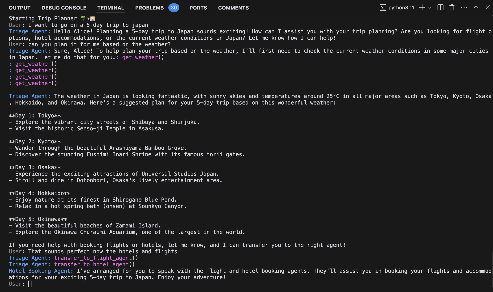
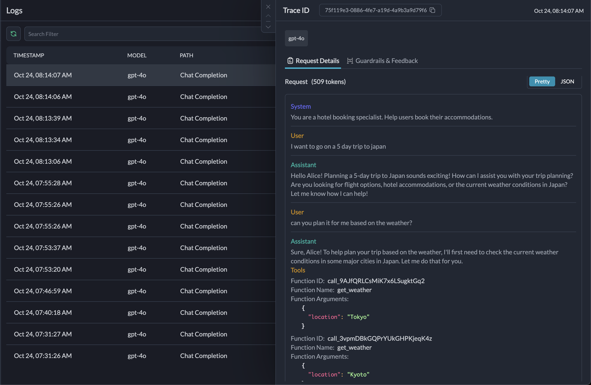
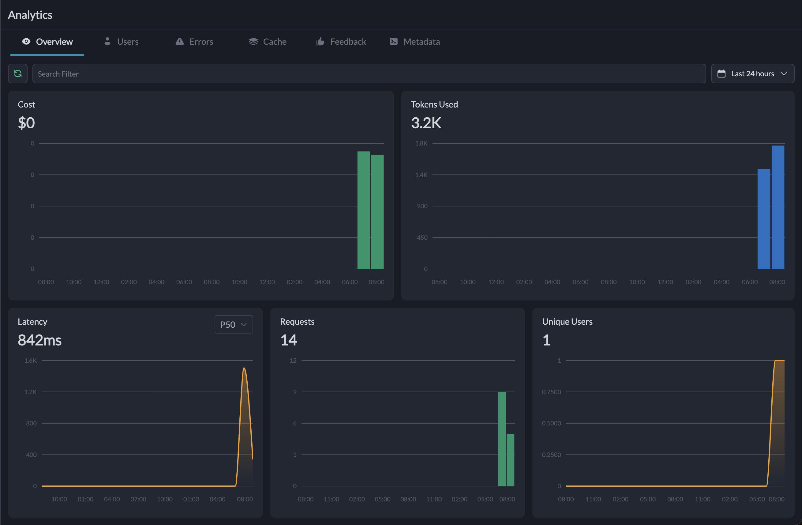

# Swarm-Portkey Project

This project demonstrates the integration of [OpenAI's Swarm](https://github.com/openai/swarm) framework with [Portkey](https://portkey.ai/) for enhanced API management and observability.

## Project Description

- Multi-agent system with specialized agents for triage, flight booking, and hotel booking
- Dynamic agent handoff based on user queries
- Context-aware responses using user-specific information
- Function calling for weather information, flight booking, and hotel reservations
- Streaming responses for a more interactive experience

## Setup

### 1. Clone the repository
```bash
git clone <your-repo-url>
cd swarm-portkey
```

### 2. Create a Conda environment
```bash
conda create -n swarm-portkey python=3.10
conda activate swarm-portkey
```

### 3. Install dependencies
```bash
pip install -r requirements.txt
```

### 4. Set environment variables
```bash
export OPENAI_API_KEY=your_actual_openai_api_key
export PORTKEY_API_KEY=your_actual_portkey_api_key
```

### 5. Run the basic script
```bash
python main.py
```

### 6. Run the advanced vacation planner example
```bash
python trip_planner.py
```

## Example Chat Prompts

Here are some example prompts you can use to interact with the trip planner:

1. General inquiry:

   ```
   User: Hi, I'm planning a trip to Paris next month. Can you help me?
   ```

2. Weather information:

   ```
   User: What's the weather like in Paris right now?
   ```

3. Flight booking:

   ```
   User: I need to book a flight from New York to Paris for July 15th.
   ```

4. Hotel booking:

   ```
   User: Can you help me find a hotel in Paris for a week-long stay?
   ```

5. Switching between agents:

   ```
   User: Actually, before we book the hotel, can we check flight options again?
   ```

6. Complex multi-step planning:

   ```
   User: I'm planning a trip to Tokyo for next week. I need help with flights, hotels, and local weather information.
   ```

Remember, the system uses mock data for demonstrations, so actual bookings and weather information are simulated.

## Results

You can view the results of the project in the following images:

### Chat


### Trace


### Metrics


## Contributing

Feel free to fork this project and submit pull requests with improvements or additional features!

## License

This project is licensed under the MIT License.

## Further Information

- [OpenAI Swarm Documentation](https://github.com/openai/swarm)
- [Portkey Documentation](https://docs.portkey.ai/)
